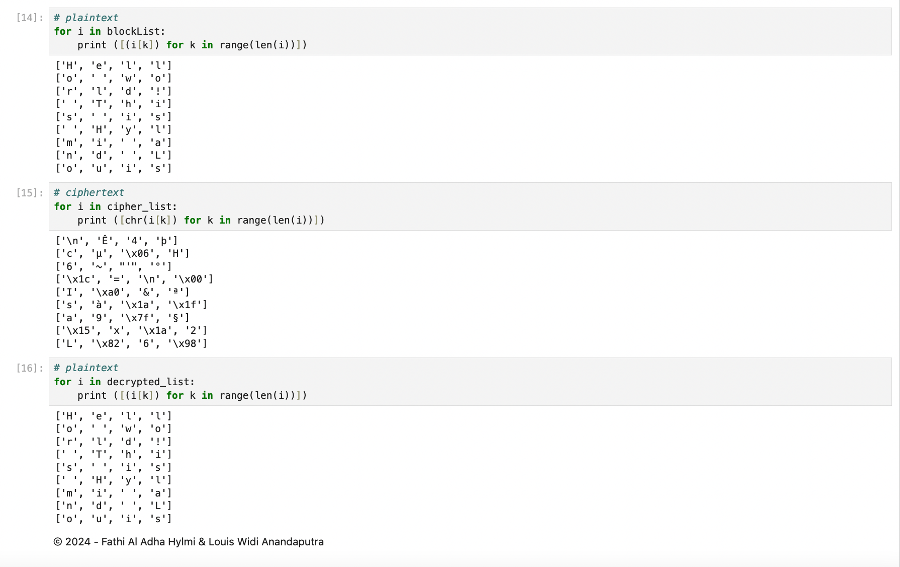

# Symmetric-Block-Cipher
Cryptography and Information Security symmetric block cipher assignment with feistel structure and CBC while incorporating finite field arithmetic on GF(2^16)

- Fathi Al Adha Hylmi
- Louis Widi Anandaputra

## CBC mode Encryption


## Feistel Structure


## Encryption - Decryption Process Result:


Environment Setup
```
conda create --name main-ds python=3.10
conda activate main-ds
pip install jupyter 

```
